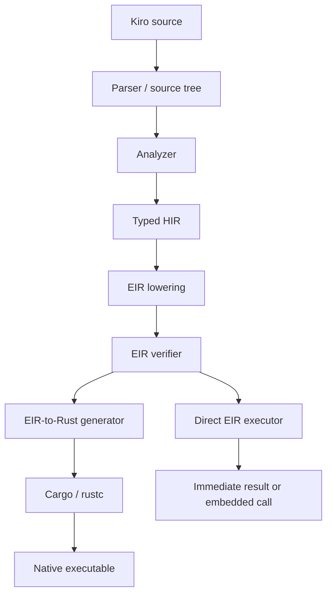

<p align="center">
  
</p>

# Kiro

Kiro is a small, statically analyzed language for native-powered scripts, workflows, and embedded application logic.

It keeps the source language compact, uses one canonical executable IR for semantics, and offers two execution paths: run EIR directly for fast feedback and embedding, or generate Rust and let Cargo produce a native binary.

> Kiro is experimental and pre-1.0. The language is usable for small programs, but its APIs and syntax may still change.

## Contents

- [Why Kiro](#why-kiro)
- [Install](#install)
- [Quick start](#quick-start)
- [One language, two execution paths](#one-language-two-execution-paths)
- [Language tour](#language-tour)
- [Projects and modules](#projects-and-modules)
- [Rust host modules](#rust-host-modules)
- [Embedding](#embedding)
- [CLI](#cli)
- [Current boundaries](#current-boundaries)
- [Build and test](#build-and-test)

## Why Kiro

Kiro is aimed at the layer between a shell script and a systems-language application. It is a good fit when control flow should stay easy to read while expensive or platform-specific work already belongs in Rust libraries.

- Immutable bindings by default, with explicit `var` mutation.
- Static types and source-level diagnostics before either execution path begins.
- `pure fn` effect checking for deterministic computation.
- Typed structs, lists, maps, addresses, pipes, functions, handles, and failable values.
- Lightweight concurrency through `run`, `give`, `take`, `close`, and `rest`.
- Rust-backed host modules without inline Rust in `.kiro` files.
- A direct EIR executor for iteration and embedding.
- A Rust backend for Cargo integration and native deployment.

The project thesis is deliberately narrow: Kiro orchestrates native capability; it does not try to replace Rust or reproduce its ecosystem.

## Install

Kiro currently builds from source and requires a recent Rust toolchain with Cargo.

```bash
git clone https://github.com/ata-sesli/kiro-lang
cd kiro-lang
cargo build --release
cp target/release/kiro-lang /usr/local/bin/kiro
```

The copy step is only an example. You can keep the binary in `target/release`, rename it, or place it anywhere on your `PATH`.

## Quick start

Create `hello.kiro`:

```kiro
import io

pure fn greeting(name: str) -> str {
    return "Hello, " + name + "!"
}

io.print(greeting("Kiro"))
```

Choose the feedback loop you want:

```bash
# Analyze, generate Rust, build with Cargo, and run the native binary
kiro hello.kiro

# Analyze, lower to EIR, and execute directly
kiro interpret hello.kiro

# Validate without executing or invoking Cargo
kiro check hello.kiro
```

Both executable paths start from the same analyzed program and the same verified EIR. They are two backends, not two independent definitions of Kiro.

## One language, two execution paths



The layers have separate jobs:

| Layer | Responsibility |
| --- | --- |
| Parser and source tree | Preserve Kiro's written structure and source spans for syntax-aware tools. |
| Analyzer and HIR | Resolve names and modules, assign stable IDs and types, and enforce language rules. |
| EIR | Express execution as typed slots, basic blocks, explicit instructions, and terminators. |
| Verifier | Reject malformed control flow, bad IDs and types, uninitialized reads, invalid calls, and effect violations. |
| Direct executor | Run verified EIR with an iterative frame stack, globals, host dispatch, cancellation, and resource limits. |
| Rust backend | Translate the same verified EIR to Rust, then use Cargo for dependencies, native compilation, and caching. |

This shared middle is the central architectural rule. A condition, move, call, error, pipe operation, or loop is lowered once. The executor and Rust generator only decide how that already-defined operation runs.

### Which path should I use?

| Need | Command or API | Tradeoff |
| --- | --- | --- |
| Fast edit-run feedback | `kiro interpret file.kiro` | Starts without a Cargo build; direct execution is not native-speed compilation. |
| Native artifact or Cargo host glue | `kiro build file.kiro` | Pays Rust compilation cost and produces a native binary. |
| Normal command-line run | `kiro file.kiro` or `kiro run file.kiro` | Uses the Rust backend and runs the result. |
| Editor or CI validation | `kiro check file.kiro` | Performs analysis only; no program execution. |
| Application embedding | `Engine` in the `kiro-lang` crate | Direct EIR execution with host registration and limits. |

## Language tour

### Bindings and types

Bindings are immutable unless declared with `var`:

```kiro
name = "Ada"
var attempts = 0
attempts = attempts + 1
```

Core types are `num`, `str`, immutable `bytes`, `bool`, and `void`. Composite types include `list T`, `map K V`, `adr T`, `pipe T`, named structs, named host handles, and function types such as `fn(num) -> num`. `len data` returns a byte count and `data at index` returns that byte as a `num`.

### Functions and purity

```kiro
pure fn square(value: num) -> num {
    return value * value
}

fn report(value: num) {
    io.print("result: " + value)
}
```

`pure fn` cannot perform I/O or other effectful operations. Named pure functions can be passed as function references:

```kiro
pure fn inc(value: num) -> num {
    return value + 1
}

pure fn apply(value: num, operation: fn(num) -> num) -> num {
    return operation(value)
}

result = apply(41, ref inc)
```

### Control flow

Kiro uses `on` and `off` for branches:

```kiro
on (temperature > 30) {
    io.print("hot")
} off {
    io.print("comfortable")
}
```

It supports while-style and iterator loops:

```kiro
var retries = 0
loop on (retries < 3) {
    retries = retries + 1
}

loop n in 0..10 per 2 on (n > 3) {
    io.print(n)
}
```

`break`, `continue`, and `return` provide explicit control signals. `check condition, "message"` stops execution with a source-anchored diagnostic when an invariant fails.

### Structs and collections

```kiro
struct User {
    name: str
    score: num
}

var user = User { name: "Mira", score: 10 }
user.score = 11

var values = list num { 2, 4, 8 }
values push 16
first = values at 0

scores = map str num { "Mira" 11, "Noa" 9 }
mira_score = scores at "Mira"
```

Collections are homogeneous and statically typed. `len value` returns the size of strings and collections.

### Errors

Functions marked with `!` can return declared Kiro errors:

```kiro
error NotFound = "item was not found"

fn lookup(found: bool) -> str! {
    on (found) {
        return "value"
    }
    return NotFound
}

result = lookup(false)
on (result) {
    io.print(result)
} error NotFound {
    io.print("missing")
} error {
    io.print("another error")
}
```

The success branch sees the unwrapped success value. Named and catch-all `error` clauses handle failure values; unhandled errors propagate through failable functions.

### Concurrency and pipes

`run` starts a fire-and-forget function. Pipes provide explicit synchronization and typed message passing:

```kiro
fn worker(done: pipe str) {
    give done "finished"
}

var done = pipe str
run worker(done)
message = take done
close done
```

`rest` is a cooperative yield point. A bounded pipe can include a numeric capacity after its type; a declaration without a capacity uses Kiro's rendezvous semantics.

### Addresses and moves

Kiro exposes a small ownership-like surface for explicit state transfer and shared mutation:

```kiro
var value = 10
pointer = ref value
deref pointer = 20
copied = deref pointer

var payload = "ready"
owned = move payload
```

`adr T` represents a typed address that may begin empty. `move` invalidates the moved binding, and the EIR verifier catches later reads.

## Projects and modules

Single-file scripts need no manifest. For a project, add `kiro.toml`:

```toml
[package]
name = "sample"
entry = "main.kiro"

[dependencies]
```

With no explicit file, `kiro`, `kiro run`, `kiro build`, and `kiro check` walk upward to the nearest manifest and use `[package].entry`.

Modules are `.kiro` files resolved relative to the importer:

```text
sample/
  kiro.toml
  main.kiro
  app/
    math.kiro
```

```kiro
import app.math

result = app.math.add(2, 3)
```

Kiro embeds standard modules for bytes, I/O, files, environment access, time, and networking. Their short names are `bytes`, `io`, `fs`, `env`, `time`, and `net`; canonical `std_*` names remain available internally. The `bytes` module provides UTF-8 and hexadecimal conversion, slicing, concatenation, and empty byte values.

Cargo-backed dependencies are declared as simple string versions under `[dependencies]`. Generated Rust state lives in `.kiro/build/`, including its Cargo manifest and lockfile. Kiro intentionally does not maintain a second package registry or lockfile.

## Rust host modules

Host modules are Kiro's native extension boundary. The `.kiro` file declares a typed contract; an adjacent `.rs` file implements it through `kiro_runtime`.

`files.kiro`:

```kiro
error NotFound = "file not found"

rust fn read_text(path: str) -> str!
```

`files.rs`:

```rust
use kiro_runtime::{HostResult, KiroError, RuntimeVal};

pub async fn read_text(args: Vec<RuntimeVal>) -> HostResult {
    RuntimeVal::expect_arity(&args, 1, "read_text")?;
    let path = RuntimeVal::expect_arg(&args, 0, "read_text")?.as_str()?;

    std::fs::read_to_string(path)
        .map(RuntimeVal::from)
        .map_err(|error| KiroError::message("NotFound", error.to_string()))
}
```

Named `handle` types let the host retain native resources without exposing their representation:

```kiro
handle Model

rust fn load(path: str) -> Model!
rust fn predict(model: Model, input: list num) -> list num!
```

Use `kiro add crate_name` to record a Cargo dependency and attempt host-module generation. Use `kiro host gen crate_name --module module_name` to regenerate or choose the Kiro module name. The generator supports a deliberately conservative subset and reports Rust API shapes it skips.

The generator maps Rust `&[u8]` and `Vec<u8>` to Kiro `bytes`. Borrowed byte parameters are passed to Rust without copying; owned `Vec<u8>` parameters make the required boundary copy, and returned vectors become shared immutable bytes.

The compiled path links adjacent Rust glue into the generated Cargo project. The direct executor can call host functions registered through the embedding API; the CLI interpreter directly implements display-oriented `io` calls but does not load arbitrary adjacent Rust glue.

## Embedding

The `engine` module exposes Kiro as a Rust-embeddable scripting engine. An application can:

- compile source and imported modules to verified EIR once;
- call a named Kiro function or run `main`;
- register typed host functions;
- choose execute, simulate, or deny behavior for host calls;
- enforce step, call-depth, and timeout limits;
- supply a custom module loader.

The engine executes the same EIR used by `kiro interpret`, so embedded behavior does not rely on a separate AST interpreter.

## CLI

| Command | Purpose |
| --- | --- |
| `kiro [file.kiro]` | Analyze, generate Rust, build, and run. |
| `kiro run [file.kiro]` | Explicit form of the normal compiled run. |
| `kiro interpret [file.kiro]` | Execute verified EIR directly. |
| `kiro check [file.kiro]` | Parse and analyze without building or running. |
| `kiro build [file.kiro]` | Generate Rust and build without execution. |
| `kiro fmt [paths...]` | Format Kiro source in place. |
| `kiro fmt --check [paths...]` | Check formatting without writing files. |
| `kiro test [paths...]` | Discover and run `*_test.kiro` programs. |
| `kiro create NAME` | Scaffold a manifest-based project. |
| `kiro add CRATE[@VERSION]` | Add a Cargo dependency and attempt host generation. |
| `kiro remove CRATE` | Remove a manifest dependency. |
| `kiro host gen CRATE` | Generate or regenerate a Rust-backed Kiro module. |
| `kiro lsp` | Start the language server over standard I/O. |

Global run/build options include `--verbose` and `--no-run`. The CLI also accepts `--emit-rust`, but the current EIR backend does not yet print generated Rust; inspect `.kiro/build/src/main.rs` after a build instead.

## Current boundaries

- Kiro is source-built and pre-1.0; there is no published binary installer described here.
- The Rust path requires Cargo and pays native compilation cost, although generated state is cached under `.kiro/build/`.
- The direct executor prioritizes feedback, embedding, limits, and semantic parity; it is not expected to match optimized native code.
- CLI interpretation does not dynamically compile adjacent Rust host glue. Use the Rust backend or register host functions through `Engine`.
- Kiro currently avoids closures, traits, enums, pattern matching, user-defined generics, overloading, nullable types, and a Kiro-native package registry.
- Function references are limited to named pure functions. Effectful recursion is rejected; pure recursion is supported.
- The host-module generator intentionally skips Rust APIs whose ownership or type shape cannot be mapped safely and predictably.

See [ROADMAP.md](ROADMAP.md) for direction, [learn-kiro](learn-kiro/) for the guided language course, and [kiro_host_modules.md](kiro_host_modules.md) for the host ABI.

## Build and test

```bash
cargo build
cargo nextest run
cargo fmt --check
cargo clippy --all-targets --all-features
```

The EIR-specific suites cover lowering, verification, direct execution, Rust generation, interpreter/compiler parity, embedding, allocation behavior, and architectural boundaries. Baseline performance notes live in [benches/README.md](benches/README.md).

## License

No license file is currently present in the repository. Treat the code as all rights reserved until the project adds an explicit license.
