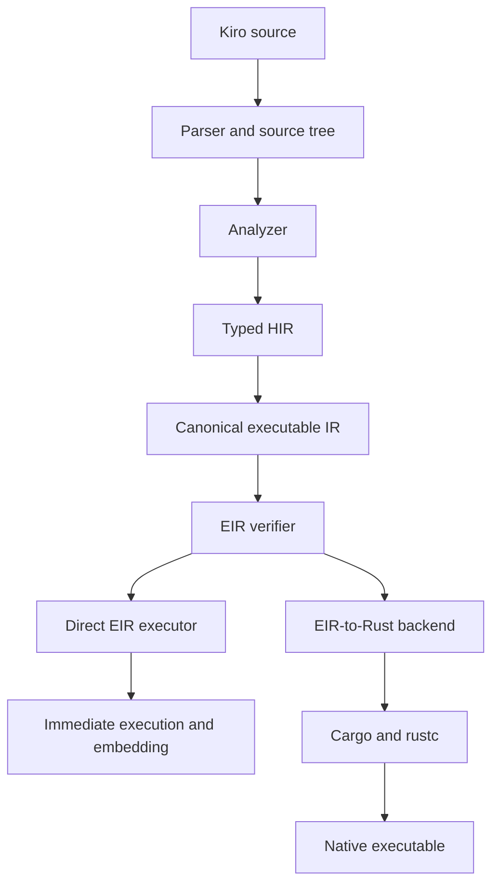

<p align="center">
  
</p>

# Kiro

Kiro is a readable, embeddable programming language that runs immediately in its own VM and compiles through Rust for native deployment.

Both paths share one typed execution model: execute verified EIR directly, or translate that same EIR to Rust and let Cargo build a native executable. Rust libraries can be exposed as typed Kiro modules, keeping application code approachable without cutting it off from native capability.

The design aims for scripting-language readability, explicit message-passing concurrency, and a practical path to native performance through Rust generation. Kiro is focused by design, but it is a complete language toolchain—not a syntax experiment or a second-class wrapper around Rust.

> Kiro is actively developed and pre-1.0. The language, runtime APIs, and tooling can still change.

## Why Kiro

Kiro is built to keep a fast feedback loop and a strong native deployment story in the same language.

- **Run immediately.** The VM executes verified Kiro EIR without waiting for a Cargo build.
- **Build natively.** The Rust backend turns the same program into a Cargo project and native executable.
- **Keep one meaning.** Analysis, ownership rules, effects, errors, control flow, and calls are defined before the execution paths split.
- **Use Rust as the capability layer.** Typed host modules connect Kiro programs to Rust crates without putting Rust syntax in `.kiro` files.
- **Embed the language.** Rust applications can compile Kiro once, call named functions, register host functions, and enforce execution limits.
- **Write concurrent workflows directly.** `run` and typed pipes make task launch and message passing part of the language.

Kiro does not try to reproduce every feature of a mature general-purpose language. Its core stays learnable while native modules provide domain-specific power.

## Quick start

Kiro currently builds from source and requires a recent Rust toolchain with Cargo:

```bash
git clone https://github.com/ata-sesli/kiro-lang
cd kiro-lang
cargo build --release
cp target/release/kiro-lang /usr/local/bin/kiro
```

The copy step is optional; the executable can live anywhere on your `PATH`.

Create `hello.kiro`:

```kiro
import io

struct Pilot {
    name: str
    energy: num
}

pure fn boost(value: num) -> num {
    return value + 5
}

fn report(out: pipe str, name: str) {
    give out name + " is ready"
}

var pilot = Pilot { name: "Astra", energy: boost(95) }
var messages = pipe str

io.print(pilot.energy)
run report(messages, pilot.name)
io.print(take messages)
```

Run it through either backend:

```bash
# Generate Rust, build with Cargo, and run the native program
kiro hello.kiro

# Execute verified EIR directly in the Kiro VM
kiro interpret hello.kiro

# Analyze without executing or invoking Cargo
kiro check hello.kiro
```

## One language, two execution paths

Kiro's interpreter and transpiler are not independent implementations of the language.



The source tree preserves written structure and spans for diagnostics, formatting, and editor tooling. HIR resolves names and assigns types. EIR then makes execution explicit through typed slots, basic blocks, instructions, and terminators.

The verifier checks that EIR is safe to execute: IDs and types must agree, branches must be valid, reads must be initialized, calls must match their signatures, and effect rules must hold. Only verified EIR reaches either backend.

| Path | Best fit | What it does |
| --- | --- | --- |
| `kiro interpret` | Fast edit-run cycles, embedding, controlled execution | Runs verified EIR directly with an iterative frame stack, host dispatch, cancellation, and resource limits. |
| `kiro build` / `kiro run` | Native artifacts, Cargo dependencies, deployment | Generates Rust from verified EIR and lets Cargo compile and cache the result. |

This shared middle is Kiro's architectural contract. A move, error, pipe operation, function call, or branch is defined once; the VM and Rust backend only choose how to execute it.

## The language

Kiro uses immutable bindings by default and requires `var` when a binding will change:

```kiro
name = "Ada"
var attempts = 0
attempts = attempts + 1
```

The core includes:

- `num`, `str`, `bytes`, `bool`, and `void`
- typed structs, lists, maps, addresses, pipes, functions, and native handles
- normal, pure, failable, and Rust-backed functions
- `on` / `off` conditions and while-style or iterator loops
- immutable bindings, explicit mutation, `move`, `ref`, and `deref`
- named errors, catch clauses, propagation, and runtime `check`
- modules and project manifests
- fire-and-forget tasks and typed message-passing pipes

### Pure functions and effects

`pure fn` marks deterministic computation. Pure functions cannot perform I/O or call effectful operations, and named pure functions can be passed by reference.

```kiro
pure fn square(value: num) -> num {
    return value * value
}

pure fn apply(value: num, operation: fn(num) -> num) -> num {
    return operation(value)
}

result = apply(9, ref square)
```

### Control flow

```kiro
on (temperature > 30) {
    io.print("hot")
} off {
    io.print("comfortable")
}

loop n in 0..10 per 2 on (n > 3) {
    io.print(n)
}
```

Kiro also supports `loop on`, `break`, `continue`, and `return`.

### Data

```kiro
struct User {
    name: str
    score: num
}

var user = User { name: "Mira", score: 10 }
user.score = 11

var values = list num { 2, 4, 8 }
values push 16

scores = map str num { "Mira" 11, "Noa" 9 }
```

Collections are homogeneous and statically typed. Kiro also supports inferred collection types when the programmer omits an explicit element type.

### Errors

```kiro
error NotFound = "item was not found"

fn lookup(found: bool) -> str! {
    on (found) {
        return "value"
    }
    return NotFound
}

result = lookup(false)
on (result) {
    io.print(result)
} error NotFound {
    io.print("missing")
} error {
    io.print("another error")
}
```

The success branch sees the unwrapped value. Named and catch-all error clauses handle failures, while unhandled failures propagate through failable functions.

### Concurrency and pipes

```kiro
fn worker(done: pipe str) {
    give done "finished"
}

var done = pipe str
run worker(done)
message = take done
close done
```

`run` launches a fire-and-forget task. Pipes provide typed synchronization with `give`, `take`, and `close`; `rest` is a cooperative yield point. Pipes can be rendezvous channels or have an explicit capacity.

## Rust is the native boundary

Kiro source declares a typed contract with `rust fn`. Rust implementation stays in adjacent glue or generated host-module files and communicates through `kiro_runtime`.

```kiro
error LoadFailed = "model could not be loaded"

handle Model

rust fn load(path: str) -> Model!
rust fn predict(model: Model, input: list num) -> list num!
```

The host-module generator inspects compatible public Rust APIs and produces Kiro declarations plus Rust conversion glue. Unsupported ownership or type shapes are skipped explicitly instead of being mapped unsafely.

```bash
# Add a Cargo dependency and attempt host-module generation
kiro add crate_name

# Generate or regenerate a module explicitly
kiro host gen crate_name --module module_name
```

The boundary supports Kiro primitives, bytes, typed collections, value structs, native handles, failable results, borrowed input views, and selected Rust API adaptations. Generated code is conservative: Rust APIs remain authoritative, and only shapes with predictable ownership and conversion rules are exposed.

See [kiro_host_modules.md](kiro_host_modules.md) for the host ABI and manual glue workflow.

## Embedding

The `engine` module exposes the direct EIR path as a Rust API. An application can:

- compile a source module and its imports once;
- run `main` or call a named Kiro function;
- register typed Rust host functions;
- execute, simulate, or deny host calls;
- enforce step, call-depth, and timeout limits;
- provide a custom module loader.

The engine runs the same verified EIR as `kiro interpret`. Embedding does not rely on an older AST interpreter or a second set of language semantics.

## Projects, modules, and Cargo

Single-file programs need no manifest. A project uses `kiro.toml`:

```toml
[package]
name = "sample"
entry = "main.kiro"

[dependencies]
```

With no explicit file, `kiro`, `kiro run`, `kiro build`, and `kiro check` search upward for the nearest manifest and use `[package].entry`.

Modules are `.kiro` files resolved relative to the importer:

```kiro
import app.math

result = app.math.add(2, 3)
```

Embedded standard modules currently cover bytes, lists, maps, I/O, files, environment access, time, and networking. Their short names are `bytes`, `lists`, `maps`, `io`, `fs`, `env`, `time`, and `net`.

Cargo dependencies are declared under `[dependencies]`. Generated Rust, Cargo metadata, and build state live under `.kiro/build/`; Kiro uses Cargo's package graph and lockfile instead of creating a parallel package ecosystem.

## CLI and tooling

| Command | Purpose |
| --- | --- |
| `kiro [file.kiro]` | Analyze, generate Rust, build, and run. |
| `kiro run [file.kiro]` | Explicit compiled run. |
| `kiro interpret [file.kiro]` | Execute verified EIR directly. |
| `kiro check [file.kiro]` | Analyze without building or running. |
| `kiro build [file.kiro]` | Generate Rust and build without execution. |
| `kiro fmt [paths...]` | Format Kiro source in place. |
| `kiro fmt --check [paths...]` | Check formatting without writing files. |
| `kiro test [paths...]` | Discover and run Kiro test programs. |
| `kiro create NAME` | Create a manifest-based project. |
| `kiro add CRATE[@VERSION]` | Add a Cargo dependency and attempt host generation. |
| `kiro remove CRATE` | Remove a manifest dependency. |
| `kiro host gen CRATE` | Generate or regenerate a Rust-backed Kiro module. |
| `kiro lsp` | Start the language server over standard I/O. |

The repository also contains Zed integration, VS Code syntax support, formatter support, hover documentation, and the [learn-kiro](learn-kiro/) course.

## Current boundaries

- Kiro is pre-1.0 and currently distributed from source.
- The native path requires Cargo and pays Rust compilation cost, with generated state cached under `.kiro/build/`.
- The VM is designed for feedback, embedding, limits, and parity. It is not expected to match optimized native code.
- CLI interpretation does not dynamically compile adjacent Rust glue. Use the Rust backend or register host functions through `Engine`.
- Kiro does not currently include closures, traits, pattern matching, user-defined generics, overloading, nullable types, or a Kiro-specific package registry.
- Function references are limited to named pure functions. Effectful recursion is rejected; pure recursion is supported.
- The host-module generator intentionally skips Rust APIs that cannot be mapped safely and predictably.

These are current design boundaries, not a description of Kiro as a toy language. See [ROADMAP.md](ROADMAP.md) for planned direction.

## Build and test

```bash
cargo build
cargo nextest run
cargo fmt --check
cargo clippy --all-targets --all-features
```

The EIR suites cover lowering, verification, direct execution, Rust generation, VM/backend parity, embedding, allocation behavior, and architectural boundaries. Performance baselines and profiling notes live in [benches/README.md](benches/README.md).

## Documentation

- [Learn Kiro](learn-kiro/) — guided language course and final project
- [Host modules](kiro_host_modules.md) — Rust host ABI and glue model
- [Standard modules](kiro_std.md) — embedded module reference
- [Roadmap](ROADMAP.md) — current direction and boundaries

## License

No license file is currently present in the repository. Treat the code as all rights reserved until an explicit license is added.
